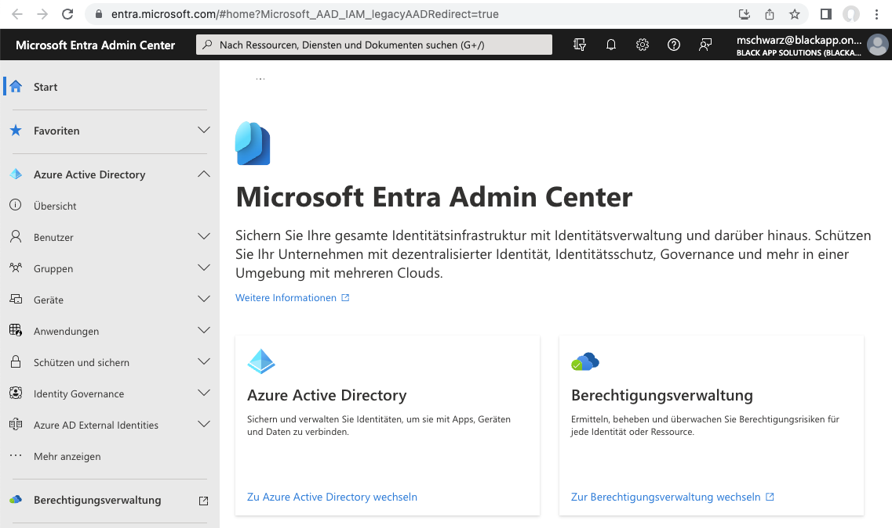
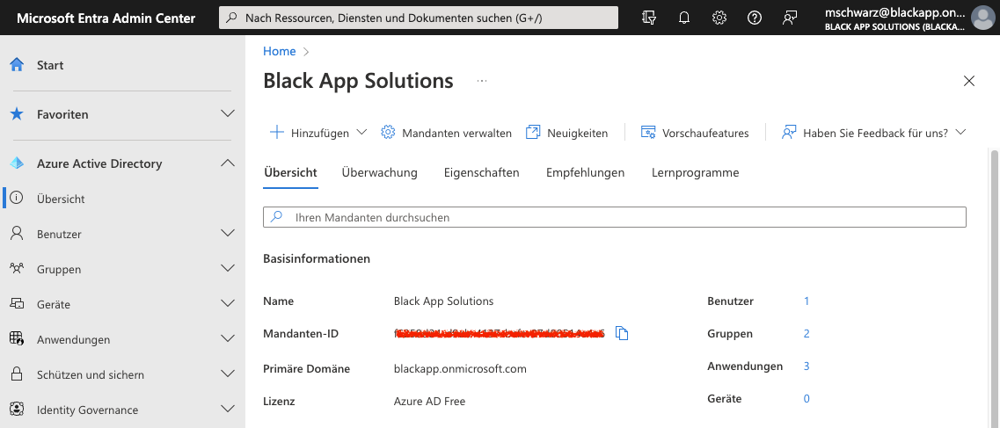
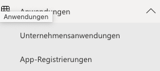
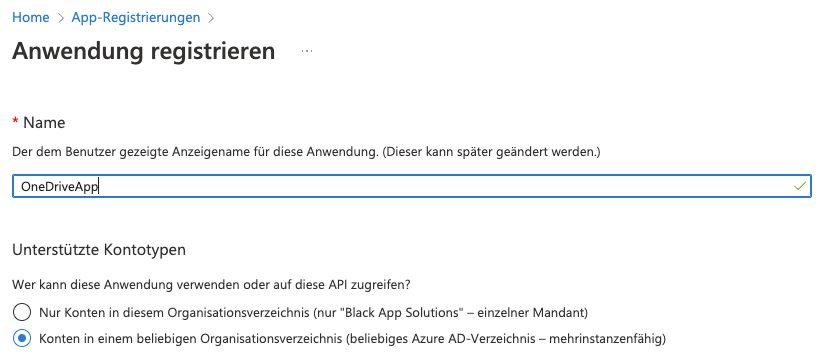
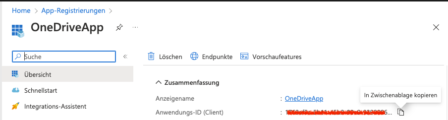
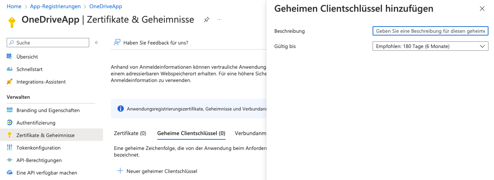
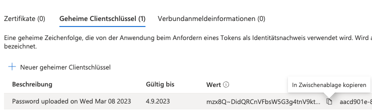
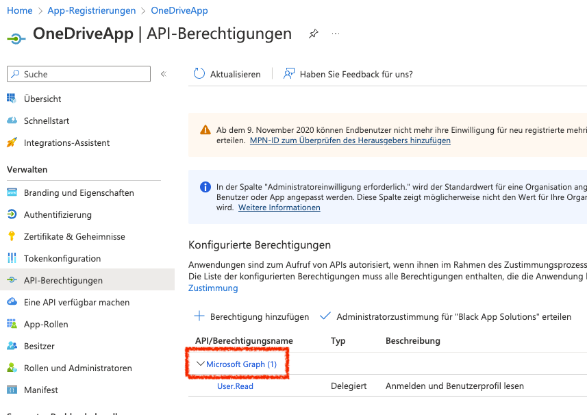
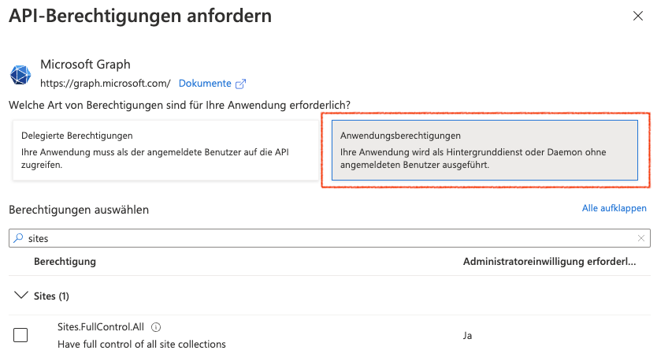
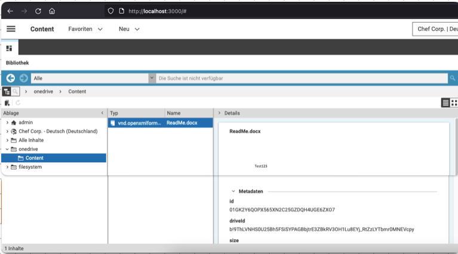

= Content Hub Adapter "OneDrive"

Fork of https://github.com/CoreMedia/content-hub-adapter-onedrive, that provides the following additions:

. fixing a hard coded filter for SharePoints "Documents" folder which is "Dokumente" in german installationsM
. Migration to CoreMedia 2301.1.0
. Additional Documentation

== Set up a "OneDrive" for testing

Despite the name of this plugin presumes, this extension only works with MicroSoft's enterprise product "SharePoint".

*There is no way to set it up with the appropriate consumer product "OneDrive".*

"SharePoint" is part of https://www.microsoft.com/de-de/microsoft-365/business/microsoft-365-business-basic[Microsoft 365 Business Basic], which could be tested one month for free.
You must provide a credit card, but you can cancel this subscription in this month at any time without being charged.

You can (and should) create a SharePoint "Team Website" right after you enrolled.

You must fill in this information into the field `driveId` in the link:docs/README.md[Studio Configuration] (see "Configure the Plugin").

The get the settings values for

. `clientId`
. `clientSecret`
. `tenantId`

go to link:https://entra.microsoft.com/#home[Microsoft Entra Admin Center] and register an app in the "Azure Active Directory".



Here you can grab the `tenantId` (called "Mandanten-ID" on the image) from the overview page.



Now to the trickiest part: The App Registration.

Open the collapsed sidebar menu Applications (or "Anwendungen" in german) and click on App-Registrations (or App-Registrierungen in german).



Then click on the Plus-Button ("New Registration" | "Neue Registrierung") and register your new app.



After that you can grab the `clientId`.



Then go to "Certificates & Secret" ("Zertifikate & Geheimnisse" in german) and a "New secret client key ("Neuer geheimer Clientschlüssel" in german).



Copy that "Value" ("Wert" in german) *immediately* (as you can't do it afterwards) and enter it as `clientSecret` in the "Studio Configuration".



Now you have retrieved all the config values the plugin needs.

In order to use the integration, you need to set up the appropriate API-Permissions (in german "API-Berechtigungen").



To do so, click on "Microsoft Graph (1)" and add `Sites.FullControl.All`.



*It is crucial, that you select the right box "Application-Permissions" ("Anwendungsberechtigungen" in german), because otherwise it will not work!*

To test your settings, I recommend to use the integration test link:studio-server/src/test/java/com/coremedia/labs/plugins/adapters/onedrive/service/OneDriveServiceIT.java[OneDriveServiceIT] first, before you build and integrate with studio. To do so, copy the appropriate values in the corresponding constants and execute the tests one by one.

== How to develop and debug this studio plugin
=== Frontend
```shell
$ cd studio-client
$ nvm use 16
$ pnpm install
$ pnpm run -r build
$ cd ##BP_ROOT##/apps/studio-client/global/studio
$ pnpm run start -- --additionalPackagesDirs ~/clients/asys/content-hub-adapter-filesystem/studio-client/apps/main/content-hub-adapter-filesystem/dist
```
=== Backend
* Build with `mvn clean install`
* Copy the final zip artefact (studio-server.content-hub-adapter-onedrive-2.0.2-SNAPSHOT.zip) to the studio-servers plugin folder.
* You can declare this folder via
  - the VM-Parameter `plugins.directories` in the studio-server startup command-line (e.g. `-Dplugins.directories=/Users/mschwarz/clients/asys/cm11-prh/apps/studio-server/bundled-plugins`) or
  - in an environment variable (mostly used in docker-ed environments) like `PLUGINS_DIRECTORIES=~/clients/asys/cm11-prh/apps/studio-server/bundled-plugins`
* For debugging also add `-agentlib:jdwp=transport=dt_socket,server=y,suspend=n,address=*:40005` in the studio-server startup command-line. Then you can use the given link:.run/Local%20Studio%20Server.run.xml[run configuration] to attach this workspace to the running studio-server.
* Checkpoint: After starting the studio-server, check if the copied zip file was automatically picked up and unpacked.

For copy convenience, you can add this maven plugin in link:studio-server/pom.xml[]

```xml
<plugin>
    <artifactId>maven-resources-plugin</artifactId>
    <version>3.1.0</version>
    <executions>
        <execution>
            <id>copy-resource-one</id>
            <phase>install</phase>
            <goals>
                <goal>copy-resources</goal>
            </goals>
            <configuration>
                <outputDirectory>/Users/mschwarz/clients/asys/cm11-prh/apps/studio-server/bundled-plugins</outputDirectory>
                <resources>
                    <resource>
                        <directory>target</directory>
                        <includes>
                            <include>studio-server.content-hub-adapter-onedrive-2.0.2-SNAPSHOT.zip</include>
                        </includes>
                    </resource>
                </resources>
            </configuration>
        </execution>
    </executions>
</plugin>
```

== How to release this plugin (pragmatic approach) and integrate it into studio-server
* Develop and test
* Increase the maven version
* Then commit the final revision and tag it
* Build the "binary" (with `mvn clean install`)
* Create a release on gitHub and upload the binary
* Copy the download link and put it into `apps/studio-server/spring-boot/studio-server-app/plugins.json`

== How to test the plugin integration
* The plugin is loaded after user login in studio
* When everything went fine, you can see a new "onedrive" node on the root level of studio's library window.
